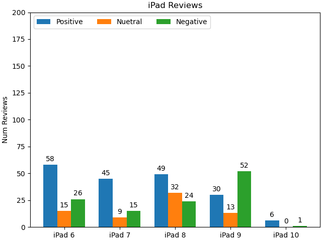

This branch was created to keep track of my CS325, Operating Systems, Final Project. This is the final project which combines the webscrapper and AI prompter that we built.

# Purpose:

   The purpose of this project is to create a program in python that reads urls from a file, pulls the reviews from the cite and then writes them to their own seperate files. The reviews were then sent off to a small language model, phi-3, which was running on my local machine through ollama, and then prompt it. Phi-3 then returned the responses. The responses where then used to create a graph of the positve, negative and nuetral reviews.

# Graph:


# Recreation:

   In order to recreate the environment that I used for this project; you will need to do the following steps. 
   **Disclaimer: ** These instructions are for a Windows machine, for Mac or Linux the steps may be different.

## Steps:
   1. First you will need to install [conda](https://docs.anaconda.com/miniconda/miniconda-install/) on your local machine 
      - I have provided a link for anaconda, and you will follow the instructions on their to install it based on your machine specifications
   2.Then, you will need to install [ollama](https://ollama.com/) and download the latest version
      - Once Ollama is successfully downloaded, run the following code in ollama:
      ```
      ollama run phi3:mini
      ```
      - This downloads a local instance of phi3 mini, the smallest version of phi3, on your local machine to use
   3. You will next need to open up Visual Studio Code, or another editor with a terminal, and then pull up the terminal.
   4. Then you will create a new folder in VS Code
   5. Next, you will paste into your VSCode terminal: 
   ```
      git clone https://github.com/peachyem/Cs325Project1.git
   ```

   - This will clone the repository to your local machine
   6. Nagivate to the Final Project Branch inside VSCode terminal
   ```
      git checkout FinalProject
   ```
   7. Now we will set up conda in order to run the program. First, type in conda in the terminal
   7. Them import the conda environment into your space.
   ```
      --name my_yaml_env --file requirement.yaml
   ```
   - my_yaml_env can be named anythin you prefer for your environment
   - this installs all specific packages tha I used for this project
   8. Finally, enter your newly created environment!
   ```
      conda activate my_yaml_env
   ```
   - This may pop up an error that says you must first run conda init, so type 
   ``` 
   conda init 
   ```
   and then retry
   - If it still does not work, try switching what terminal you are using, command prompt seemed to reliably work for me
   9. Finally, you will click into reviewer.py and hit run. You should then see all reviews in each text response file